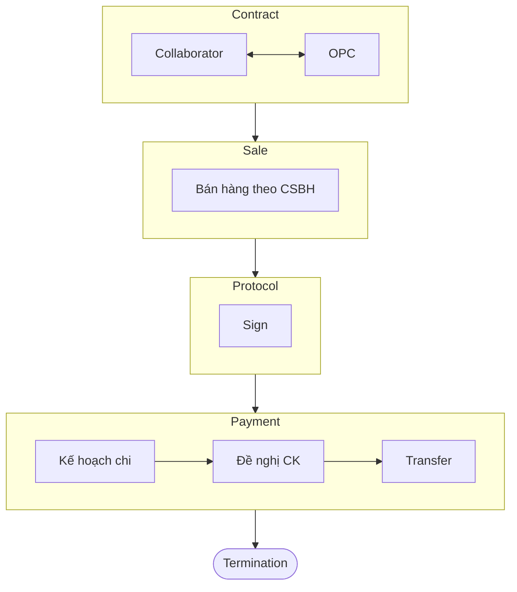

# CỘNG TÁC VIÊN
Hình thức bán hàng QTSK qua cộng tác viên theo [Quyết định số 999/QĐ-OPC](https://drive.google.com/file/d/1B2Lk9HcNBfdtNgF211wBbAgIxdUX_llF/view?usp=drive_open).
## Condition
Điều kiện đăng ký cộng tác viên:

- Đã tham gia BHXH.
- Không phải nhân viên của OPC
- Có đóng góp vào quá trình bán hàng

Trường hợp cộng tác viên đang làm việc cho khách hàng thì bắt buộc phải là người tham gia vào quá trình ra **quyết định mua hàng** (bộ phận thu mua/ quản lý ngành hàng...).

Các trường hợp không được hưởng chính sách cộng tác viên:

- Đại diện pháp luật của khách hàng.
- Người chỉ có **vai trò bán ra** của khách hàng (nhân viên bán hàng).

## Flowchart

## Activity
### Contract
- Đơn vị kinh doanh tìm kiếm, phát triển cộng tác viên đáp ứng điều kiện quy định.
- Đơn vị kinh doanh trình *Hợp đồng dịch vụ*, bao gồm giải trình rõ vai trò của cộng tác viên (Người ra quyết định mua hàng/ NVKD bán kèm/ Người kết nối...).
- [Mẫu hợp đồng tham khảo](https://docs.google.com/document/d/19Ko6y9shQIcYm4b3cs8pNLEC4LuTuwAA1ZUuHFlt5Xc/edit?usp=sharing).
- Hợp đồng cộng tác viên do TGĐ phê duyệt trừ trường hợp Giám đốc đơn vị có văn bản ủy quyền của TGĐ.
### Sale
Cộng tác viên bán hàng theo Chính sách bán hàng quy định.
### Protocol
Định kỳ hàng tháng, đơn vị kinh doanh lập bảng kê để quyết toán cho cộng tác viên.
BẢNG KÊ
| CTV| KH | Invoice num | Invoice date | DT | Tỷ lệ | Chi phí |
| --- | --- | --- | --- | --- | --- | --- |
|   |   |   |   |   |   |   |
|   |   |   |   |   |   |   |
|   |   |   |   |   |   |   |

Đại diện đơn vị kinh doanh
*(Ký tên, đóng dấu)*
### Payment

1. Sau khi lập bảng kê, đưa chi phí vào Kế hoạch chi theo SOP thu chi chuyển khoản
2. Lập đề nghị chuyển khoản
3. Chuyển khoản
4. Thông báo cho Cộng tác viên

### Termination
Thanh lý hợp đồng cộng tác viên trong những trường hợp sau đây:
 
 - Không phát sinh doanh thu trong vòng 1 quý.
 - Thỏa thuận giữa 2 bên.
 - Không còn đáp ứng tiêu chuẩn cộng tác viên.

## Other
- Trường hợp khách hàng mới do *Cộng tác viên* mang về, đơn vị kinh doanh vẫn phải giao cho 1 TDV quản lý. Người trực tiếp giao dịch là *Cộng tác viên* còn TDV là người hỗ trợ.
- Trường hợp *Cộng tác viên* kết thúc hợp đồng thì TDV có trách nhiệm tiếp quản khách hàng.
- TDV, đơn vị kinh doanh vẫn được ghi nhận doanh thu và hưởng đầy đủ quyền lợi khi triển khai bán hàng qua *Cộng tác viên* (bao gồm lương/ thưởng).
- Công ty có quyền kiểm tra để đảm bảo *Cộng tác viên* có vai trò đúng như đơn vị kinh doanh đã khai báo.

